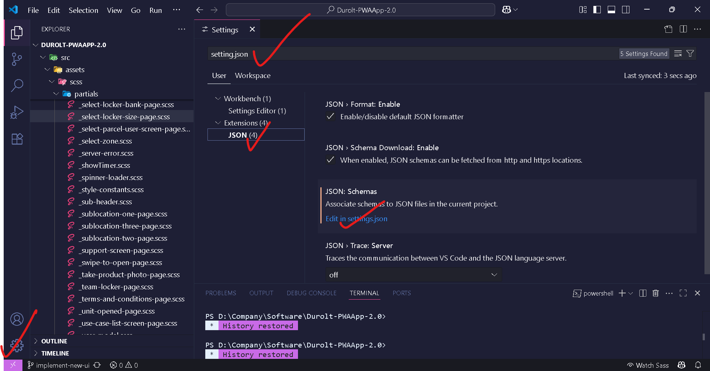
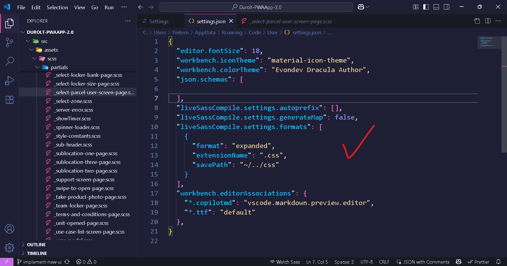

Thanks for the clear screenshot. Based on your folder structure, you have:

```
src/
├── assets/
│   ├── css/
│   │   ├── main.css       ✅ You want this to be updated automatically
│   ├── scss/
│       ├── main.scss
│       ├── main.css       ✅ This is being generated currently from SCSS
```

### ✅ **What’s Happening Now:**

Your SCSS compiler (like `sass --watch`) is compiling `scss/main.scss` to `scss/main.css`.

---

## ✅ **What You Want:**

You want to automatically compile `scss/main.scss` to `assets/css/main.css` instead of (or in addition to) `assets/scss/main.css`.

---

## ✅ **Solution: Update Sass Watch Command**

In your terminal, run:

```bash
sass src/assets/scss/main.scss src/assets/css/main.css --watch
```

---

## ✅ **If You Want to Watch the Whole Folder**

To watch all `.scss` files and compile them into the `css` folder:

```bash
sass src/assets/scss:src/assets/css --watch
```

This will compile:

```
src/assets/scss/main.scss  --->  src/assets/css/main.css
src/assets/scss/other.scss --->  src/assets/css/other.css
```

---

## ✅ **Permanent Script in `package.json`**

You can add this to your `package.json` for convenience:

```json
"scripts": {
  "scss:watch": "sass src/assets/scss:src/assets/css --watch"
}
```

Then run:

```bash
npm run scss:watch
```

---

## ✅ **Summary**

✔ Use `sass src/assets/scss:src/assets/css --watch` to reflect SCSS changes into your `css/main.css`.
✔ You can automate this via an NPM script for convenience.

---

### Want me to help set this up properly inside your project step by step? Just say **"Yes, guide me step by step."**

#### ----------------- other ---------------------------
## Question: so what about this "sass": "sass src/assets/scss/main.scss:src/assets/css/main.css src/assets/scss/durolt.scss:public/assets/css/durolt.css --no-source-map",  ------

Great question! Let's break down your `"sass"` script clearly:

---

## ✅ **Your Existing Script**

```json
"sass": "sass src/assets/scss/main.scss:src/assets/css/main.css src/assets/scss/durolt.scss:public/assets/css/durolt.css --no-source-map"
```

---

## ✅ **What It Does**

1. **Compiles `main.scss` → `assets/css/main.css`**

```
src/assets/scss/main.scss → src/assets/css/main.css
```

2. **Compiles `durolt.scss` → `public/assets/css/durolt.css`**

```
src/assets/scss/durolt.scss → public/assets/css/durolt.css
```

3. **`--no-source-map`** disables the generation of `.map` files.

---

## ✅ **What’s Missing**

This script is a one-time compilation — it **does NOT watch** for changes. If you run:

```bash
npm run sass
```

It will compile once, but future SCSS changes won't auto-reflect until you run the command again.

---

## ✅ **What You Should Add**

For automatic updates when SCSS files change, you need a **watch script**, like:

```json
"sass:watch": "sass src/assets/scss/main.scss:src/assets/css/main.css src/assets/scss/durolt.scss:public/assets/css/durolt.css --watch --no-source-map"
```

---

## ✅ **How to Use**

1. One-time build:

```bash
npm run sass
```

2. Continuous watch mode:

```bash
npm run sass:watch
```

---

## ✅ **Conclusion**

✔ Your existing `"sass"` script is good for a one-time build.
✔ To reflect SCSS changes automatically into `css/main.css` or other files, use `sass --watch`.
✔ You can manage both in `package.json` for convenience.

---

**Want me to suggest the complete updated `package.json` scripts block for you?** Just say:
👉 `"Yes, update package.json block."`

so in final word when ever  we will define new variable in urolt.scss and main.scss and want to Generate css file with repect to that that not direnctly untill we foolow two ways
    - using watch scss extesion: live compilition of SASS or SCSS to CSS 
    - using command : npm run sass:watch (but for this we need to define the watch sass in package.json as well) as like: "sass:watch": "sass src/assets/scss/main.scss:src/assets/css/main.css src/assets/scss/durolt.scss:public/assets/css/durolt.css --watch --no-source-map"


## Question-2: to configure the Scss in new Loptop ----------
    - basically configuration of sass based on this project folder structure 
    - first we need to edit the setting.json of vs code from the setting 
    - and paste this below code in 
    - 
```
"liveSassCompile.settings.autoprefix": [],
  "liveSassCompile.settings.generateMap": false,
  "liveSassCompile.settings.formats": [
    {
      "format": "expanded",
      "extensionName": ".css",
      "savePath": "~/../css"
    }
  ],
  "workbench.editorAssociations": {
    "*.copilotmd": "vscode.markdown.preview.editor",
    "*.ttf": "default"
  },
```
    - 


## ---- Question-3: use of _mixin.scss file 

Using **partials** and **`_mixin.scss`** in SCSS (SASS) helps **organize**, **reuse**, and **maintain** styles better, especially in large projects.

---

## ✅ 1. What is a SCSS Partial?

A **partial** is a small SCSS file that holds a part of your code and is **not compiled directly** into CSS.
It starts with an **underscore (`_`)**, like `_header.scss`, `_variables.scss`, `_mixin.scss`.

### 🔧 Example File Structure:

```
scss/
├── main.scss
├── _variables.scss
├── _mixin.scss
├── _header.scss
├── _footer.scss
└── _buttons.scss
```

---

## ✅ 2. How to Use Partials

You import them into your `main.scss` like this:

```scss
// main.scss

@import 'variables';
@import 'mixin';
@import 'header';
@import 'footer';
@import 'buttons';
```

* No need to write the underscore or file extension.
* All the partials get combined into one CSS file when compiled.

---

## ✅ 3. What is `_mixin.scss`?

The `_mixin.scss` file stores **reusable functions and blocks of CSS**, using the `@mixin` and `@include` syntax.

### 🔧 Example:

```scss
// _mixin.scss

@mixin flex-center {
  display: flex;
  justify-content: center;
  align-items: center;
}

@mixin media($breakpoint) {
  @if $breakpoint == mobile {
    @media (max-width: 768px) {
      @content;
    }
  }
}
```

---

### ✅ Using a mixin in your components:

```scss
// _header.scss

.header {
  @include flex-center;
  height: 60px;
  background-color: #222;

  @include media(mobile) {
    height: 40px;
  }
}
```

---

## ✅ Benefits

* 💡 Better **code reuse** (write once, use everywhere).
* 📂 Clean and **modular structure**.
* 🚀 Faster to find and update styles.
* 💼 Essential for team projects and large-scale applications.

---

Would you like me to generate a starter SCSS folder structure with some useful mixins?
